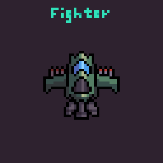
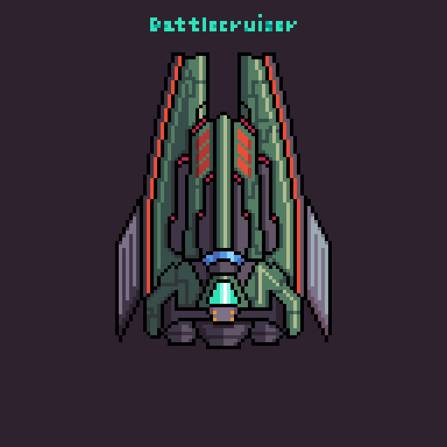
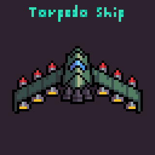

# Platypus Out of Clay

## Project Overview

***Platypus Out of Clay*** is a 2D side-scrolling shooter inspired by the classic game *"Platypus"* where players control a spaceship to battle challenging enemies, collect powerful power-ups, defeat bosses, and test their skills in an endless mode.

## Features

- **Dynamic Gameplay:** Navigate multiple levels with challenging enemy patterns.
- **Power-ups:** Temporarily enhance your ship by collecting various power-ups:
  - **Shotgun Mode:** Fires multiple projectiles in a spread pattern.
  - **Increased Fire Rate:** Boosts projectile firing speed.
  - **Beam Mode:** Fires a continuous, powerful laser beam.
  - **Missile Mode:** Launches guided missiles using FSM tracking.

- **Enemy Types:** Diverse enemies, each with unique behaviors:

| Enemy Type       | Description                                                         | Preview                      |
|------------------|---------------------------------------------------------------------|------------------------------|
| **Standard Enemy** | Moves horizontally, aiming directly at the player.                  |  |
| **Tracking Enemy** | Launches missiles that track players for a limited time.            |  |
| **Wave Enemy**     | Moves in sine-wave patterns, dropping bombs.                        |  |

- **Endless Mode:** Test your endurance against infinite enemy waves and compete for high scores.

## Game Controls

| Action        | Key       |
|---------------|-----------|
| Movement      | W, A, S, D|
| Shoot         | Space Bar |
