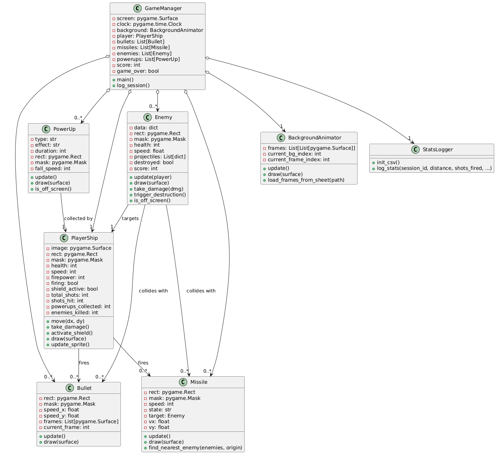

## Project Overview

**Platypus Out of Clay** is a 2D side-scrolling shooter inspired by the classic game *Platypus*. Take control of spaceship, dodge hostile fire, collect power-ups, and survive waves of uniquely programmed enemies. The game features endless mode, difficulty scaling over time, and responsive animations for movement, combat, and destruction.

## Features

- **🎮 Smooth & Dynamic Gameplay**
  - Responsive WASD movement with animated engine effects.
  - Spacebar-controlled weapons with firing animation.
  - Visual shield effect activates briefly after taking damage.

- **💥 Power-Ups**
  - Power-ups are dropped by defeated enemies and provide temporary boosts:
    - **Shotgun (SG):** Fires a 5-way spread of bullets.
    - **Increased Fire Rate (IF):** Reduces time between shots.
    - **Missile (MS):** Fires guided missiles with FSM tracking.

- **👾 Enemy Types**
  - Each enemy ship features behavior and weapon patterns:

| Enemy Type       | Description                                                        | Preview                              |
|------------------|--------------------------------------------------------------------|--------------------------------------|
| **Fighter**       | Patrols vertically and fires forward projectiles.                  |  |
| **Battlecruiser** | Heavily armored, launches tracking rockets at the player.          |  |
| **Torpedo**       | Moves in a sine-wave pattern and drops downward bombs.             |  |

- **📈 Endless Mode & Difficulty Scaling**
  - Difficulty increases automatically every minute:
    - Enemies move faster, shoot more, and become tougher.
  - On-screen blinking alert notifies players when the difficulty scales.

- **📊 Gameplay Logging & Visualization**
  - Each game session is recorded to `gamedata.csv`, including:
    - Score, accuracy, power-up usage, survival time, and more.
  - Use `visualizations.py` to generate graphs of your performance using `matplotlib`.

- **💀 Game Over & Restart Options**
  - Game Over screen appears with semi-transparent overlay.
  - Press **E** to restart instantly, or **Q** to quit (stats saved via `stats_logger.py`).

## 📘 UML Class Diagram

Here is the class structure of **Platypus Out of Clay**:

## 🎬 Video

Click below to watch a presentations of **Platypus Out of Clay**:

