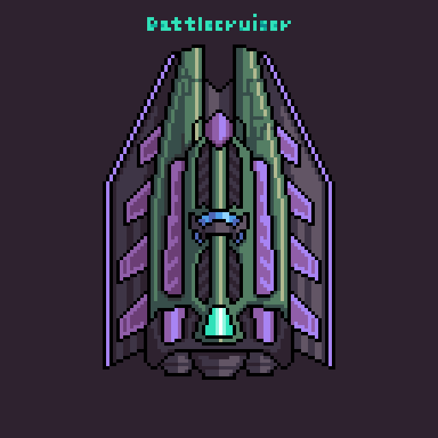

# Platypus Out of Clay

## Project Overview

***Platyous Out of Clay*** is a 2D-side-scrolling shooting inspired by the classic game "Platypus" where player control a spaceship to battle again challenge enemies with the powerful power-up to defeat the boss and test your skill an endless mode

## Feature

- **Dynamic Gameplay:** Navigate multiple levels with challenging enemy patterns.
- **Power-ups:** Enhance your ship temporarily by collecting and customizing various power-ups:
  - **Shotgun Mode:** Fires multiple projectiles in a spread pattern.
  - **Increased Fire Rate:** Boosts projectile firing speed.
  - **Beam Mode:** Continuous powerful laser beam.
  - **Missile Mode:** Launches guided missiles using FSM to tracking.

- **Enemy Types:** Diverse enemies each with unique behaviors:
  - **Standard Enemy:** Moves horizontally, aiming directly at the player.
  
  - **Tracking Enemy:** Launches missiles that track players for a limited time.
  
  - **Wave Enemy:** Moves in sine-wave patterns, dropping bombs.
  
  - **Bosses:** Appear at timed intervals, using combined enemy attack patterns and summoning reinforcements.
  

- **Endless Mode:** Test endurance by fighting endless waves of enemies for high-score competition.
